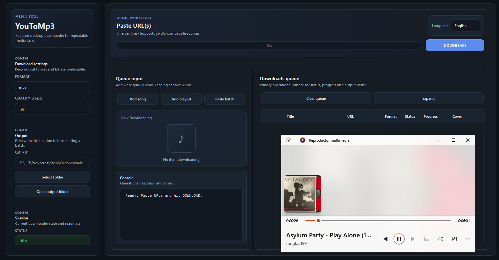
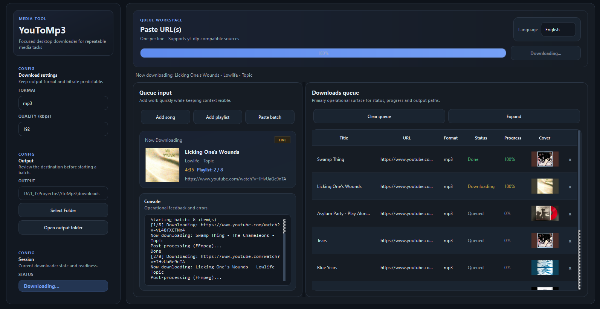
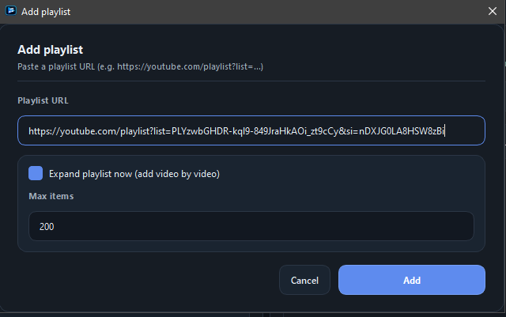

# YouToMp3 Pro

A PySide6 desktop YouTube audio downloader with queue management, embedded metadata, and a responsive desktop workflow.

[](#)
[](#)
[](#)
[](#)
[](./LICENSE)
[](#)

## Overview

YouToMp3 Pro is a desktop application for downloading audio from YouTube and other `yt-dlp` compatible sources through a native PySide6 interface. It is designed as a practical desktop tool rather than a one-off script: you can queue multiple items, add full playlists, monitor live progress, review console logs, and keep the interface responsive while metadata and playlist items are being resolved in the background.

The project focuses on a polished desktop workflow with real operational features, including title resolution as items are added, thumbnail previews in the queue, metadata and cover embedding when supported, and safeguards that prevent users from removing the item currently being downloaded.

## Features

- Download a single video directly from a URL
- Add playlists as a batch or expand them into individual queue items
- Export audio as `mp3`, `m4a`, or `wav`
- Embed metadata into supported output formats
- Embed thumbnails into supported output formats
- Resolve video titles early when items are added to the queue
- Show thumbnail artwork directly in the queue table
- Display live progress while downloads are running
- Keep the UI responsive during playlist processing
- Review download events and errors in a built-in console log
- Manage a queue of pending and completed items
- Prevent accidental removal of the item currently being downloaded
- Store output files in a user-selected folder

## Screenshots

### Main Window



### Queue and Metadata



### Playlist Dialog



## Installation

### Windows

This project is currently aimed primarily at Windows, but Linux and macOS users can still run it from source if Python, Qt, and FFmpeg are available in their environment.

### 1. Install Python

Install **Python 3.10 or newer** from the official Python website.

During installation on Windows:

- Enable `Add python.exe to PATH`
- Keep `pip` enabled
- Recommended: install for the current user unless you need a system-wide setup

Verify the installation:

```powershell
python --version
pip --version
```

### 2. Clone the Repository

```powershell
git clone <your-repository-url>
cd YtoMp3
```

### 3. Create and Activate a Virtual Environment

```powershell
python -m venv .venv
.venv\Scripts\activate
```

### 4. Install Python Dependencies

```powershell
python -m pip install --upgrade pip
pip install -r requirements.txt
```

This installs the main Python dependencies used by the app, including:

- `PySide6` for the desktop UI
- `yt-dlp` for extracting and downloading media
- `mutagen` for metadata handling

## yt-dlp Setup

`yt-dlp` is already included in [`requirements.txt`](requirements.txt), so you do **not** need to install it separately for normal use.

If you want to manually update it later, you can run:

```powershell
python -m pip install -U yt-dlp
```

## FFmpeg Setup on Windows

FFmpeg is required for audio conversion, metadata processing, and thumbnail embedding.

### 1. Download FFmpeg

Download a Windows FFmpeg build from the official FFmpeg download page and choose a Windows release package in `.zip` format.

### 2. Extract FFmpeg

Extract the archive to a stable location such as:

```text
C:\ffmpeg
```

After extraction, you should have a structure similar to:

```text
C:\ffmpeg
└── bin
    ├── ffmpeg.exe
    ├── ffprobe.exe
    └── ffplay.exe
```

### 3. Add FFmpeg to PATH

1. Open the Windows Start menu
2. Search for `Environment Variables`
3. Open `Edit the system environment variables`
4. Click `Environment Variables...`
5. Under `User variables` or `System variables`, select `Path`
6. Click `Edit`
7. Click `New`
8. Add:

```text
C:\ffmpeg\bin
```

9. Confirm all dialogs with `OK`
10. Close and reopen your terminal

### 4. Verify FFmpeg

```powershell
ffmpeg -version
where ffmpeg
```

If both commands work, FFmpeg is available to the app.

## Run from Source

From the project root:

```powershell
python -m app.main
```

If everything is configured correctly, the desktop window should open and the app will be ready to use.

## Build a Windows Executable

You can package the app as a Windows `.exe` using PyInstaller.

### 1. Install PyInstaller

```powershell
python -m pip install pyinstaller
```

### 2. Build the App

From the project root:

```powershell
pyinstaller --noconfirm --windowed --name "YouToMp3-Pro" --icon assets/icon.ico --add-data "assets;assets" app/main.py
```

### 3. Output

After a successful build, the executable will be available in:

```text
dist\YouToMp3-Pro\
```

Typical entry point:

```text
dist\YouToMp3-Pro\YouToMp3-Pro.exe
```

### Notes

- The command above uses a **one-folder** build, which is usually the most reliable option for PySide6 desktop apps.
- If you want a single-file executable, you can experiment with `--onefile`, but startup time and packaging complexity may increase.
- If you build on Linux or macOS, PyInstaller uses a different `--add-data` separator:
- Windows: `assets;assets`
- Linux/macOS: `assets:assets`

## Project Structure

```text
YtoMp3/
├── app/
│   ├── main.py
│   ├── downloader.py
│   └── ui/
│       ├── controller.py
│       ├── dialogs.py
│       ├── i18n.py
│       ├── now_downloading.py
│       ├── queue_manager.py
│       ├── settings.py
│       ├── style.py
│       ├── widgets.py
│       ├── window.py
│       └── worker.py
├── assets/
│   └── icon.ico
├── requirements.txt
├── LICENSE
└── test_download.py
```
## Download

Download the Windows build from the assets section of this release:

YouToMp3-Pro-windows-v1.0.0.zip

After downloading:

1. Extract the zip file
2. Open the extracted folder
3. Run YouToMp3-Pro.exe
   
## Technologies Used

- **Python** for the application logic
- **PySide6** for the native desktop UI
- **yt-dlp** for media extraction and downloading
- **FFmpeg** for conversion, post-processing, and embedding
- **Mutagen** for audio metadata handling
- **PyInstaller** for Windows packaging

## Why This Project Exists

This project was built as a portfolio-grade desktop application that goes beyond a basic downloader script. It demonstrates:

- practical PySide6 desktop application architecture
- queue-based workflows for real user tasks
- background threading with signal/slot-safe UI updates
- metadata and media-processing integration
- thoughtful desktop UX decisions such as responsive playlist handling and active-row protection
- maintainable separation between UI, controller logic, workers, and download services

For a portfolio, it is valuable because it combines product thinking, native desktop UI work, threading, media tooling, and packaging into one cohesive project.

## License

This project is licensed under the **GNU General Public License v3.0**.

See the full license in [`LICENSE`](./LICENSE).

## Responsible Use

This software is provided for lawful and responsible use only.

Please make sure that you:

- only download content you own or have permission to download
- comply with local laws and copyright regulations
- respect the terms of service of the platforms you use
- avoid using the application for unauthorized distribution of protected material

The author does not endorse misuse of this project.
