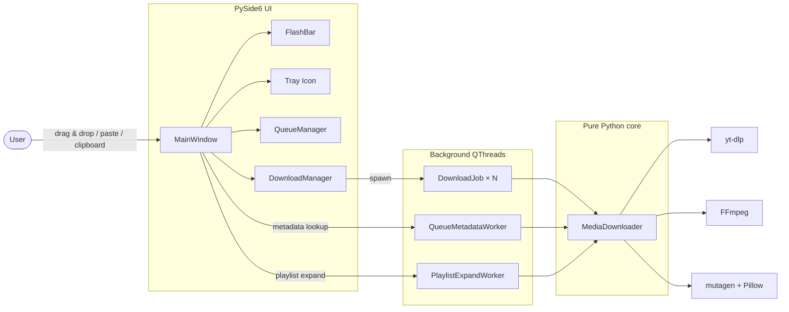

# YouToMp3 Pro

A portfolio-grade PySide6 desktop YouTube downloader with concurrent jobs, per-item cancel, SponsorBlock, audio trim, system tray, drag &amp; drop and a fully mocked test suite.

[](https://github.com/kriv-bit/YouToMP3/actions/workflows/ci.yml)
[](https://github.com/kriv-bit/YouToMP3/releases/latest)
[](#)
[](#)
[](#)
[](#)
[](./LICENSE)

## Engineering highlights

The codebase is intentionally small but tries to demonstrate the things a senior reviewer would look at:

- **Concurrent download pipeline** — a coordinator (`DownloadManager`) dispatches up to four `DownloadJob` workers on separate `QThread`s with cooperative cancellation through the yt-dlp progress hook, queue-level pause/resume, and aggregated overall progress.
- **Decoupled architecture** — `MediaDownloader` (pure logic over yt-dlp / mutagen / Pillow) is fully decoupled from PySide6; the UI orchestrates it through a thin `MainController` and Qt signals.
- **Real test suite, no network** — 167 pytest cases. `yt-dlp`, HTTP, `mutagen`, the clipboard and `QSystemTrayIcon` are all mocked; the suite runs offline in &lt;5&nbsp;s.
- **CI &amp; release automation** — GitHub Actions runs `ruff` + `pytest` on Ubuntu and Windows across Python 3.10–3.12, and tagged releases (`v*`) trigger an automated PyInstaller build attached to the GitHub Release.
- **Desktop-native UX** — drag &amp; drop URLs, clipboard auto-detection with a non-modal `FlashBar`, system tray with native completion toasts, persistent dark/light theme, EN/ES i18n and an offscreen-safe layout for headless tests.
- **Useful product features** — SponsorBlock segment removal, per-item audio trim (`SS` / `MM:SS` / `HH:MM:SS`), thumbnail and ID3v3 metadata embedding, playlist expansion with deduplication, and a queue that survives app restart.

## Features

User-facing capabilities, grouped:

| Area | Capabilities |
|---|---|
| **Sources** | Single URL, full playlists (lazy or pre-expanded), drag &amp; drop, clipboard auto-detect, paste-batch |
| **Output** | MP3 / M4A / WAV (configurable bitrate) and MP4; embedded ID3v3 / iTunes tags and cover art |
| **Workflow** | 1–4 concurrent downloads, pause / resume the queue, cancel an individual item, prevent deletion of running rows, queue persists across restarts |
| **Trimming** | Per-item start / end timestamps with keyframe-aligned cuts |
| **SponsorBlock** | Toggle to remove sponsor / self-promo / intro / outro / music-offtopic segments |
| **Polish** | Light &amp; dark theme, EN / ES translations, system tray with completion toasts, console log, status indicator |

## Screenshots

| Main workspace | Queue with thumbnails | Add a playlist |
| --- | --- | --- |
|  |  |  |

## Architecture



A copy of the same flow in prose:

1. **`MainWindow`** wires three lightweight UI helpers (`FlashBar` for clipboard prompts, `AppTrayIcon` for native toasts, `QueueManager` for the table) and a single long-lived **`DownloadManager`**.
2. The user adds URLs through dialogs, drag &amp; drop, or the clipboard watcher; each row gets a background **metadata lookup** so titles and thumbnails appear before the actual download.
3. On *Download*, the manager pops items off the queue and runs them through **`DownloadJob`** workers (1–4 in parallel). Each job lives on its own `QThread` with a cancel flag and an aggregated progress feed.
4. **`MediaDownloader`** is the only module that talks to `yt-dlp`. It composes format-specific postprocessor chains (audio extract, metadata, optional SponsorBlock + ModifyChapters, optional `download_ranges` for trim) and falls back across YouTube player clients on 403s.
5. After download, **mutagen + Pillow** normalize the tags and embed a square JPEG cover.

## Install &amp; run

### Pre-built Windows binary

Grab the latest `.zip` from [Releases](https://github.com/kriv-bit/YouToMP3/releases/latest), extract it, make sure **FFmpeg** is on `PATH`, and run `YouToMp3-Pro.exe`.

### From source (any OS)

```powershell
# 1. Python 3.10+
python --version

# 2. Clone
git clone https://github.com/kriv-bit/YouToMP3.git
cd YouToMP3

# 3. Virtual env
python -m venv .venv
.venv\Scripts\activate          # Windows
# source .venv/bin/activate     # macOS / Linux

# 4. Install
python -m pip install --upgrade pip
pip install -r requirements.txt

# 5. Run
python -m app.main
```

`yt-dlp` and `mutagen` come from `requirements.txt`. **FFmpeg** must be installed separately and reachable on `PATH` — see [FFmpeg setup](#ffmpeg-setup-windows) below for Windows.

### FFmpeg setup (Windows)

1. Download an FFmpeg Windows build (`.zip`) from the official site.
2. Extract to a stable folder, e.g. `C:\ffmpeg`. You should now have `C:\ffmpeg\bin\ffmpeg.exe`.
3. Add `C:\ffmpeg\bin` to `Path` (System Properties → Environment Variables).
4. Open a fresh terminal and verify with `ffmpeg -version`.

## Development

The test suite runs offline thanks to mocks for yt-dlp, HTTP and mutagen.

```powershell
pip install -r requirements-dev.txt

pytest                          # 167 tests, &lt;5 s
pytest --cov=app                # with coverage
ruff check .                    # lint
```

CI is in [`.github/workflows/ci.yml`](.github/workflows/ci.yml). A tag push (`v1.0.0`, `v1.1.0`, …) triggers [`.github/workflows/release.yml`](.github/workflows/release.yml) which builds the Windows executable with PyInstaller and attaches it to the GitHub Release.

### Build a Windows executable locally

```powershell
pip install pyinstaller
pyinstaller --noconfirm YouToMp3-Pro.spec
# → dist\YouToMp3-Pro\YouToMp3-Pro.exe
```

## Project structure

```text
YtoMp3/
├── app/
│   ├── main.py
│   ├── downloader.py            # yt-dlp orchestration + tag/artwork embedding
│   ├── timestamp.py             # SS / MM:SS / HH:MM:SS parsing for trim
│   └── ui/
│       ├── window.py            # MainWindow, layout, drag&amp;drop, tray wiring
│       ├── controller.py        # MainController — dialogs, queue actions
│       ├── download_manager.py  # DownloadManager + DownloadJob
│       ├── worker.py            # QueueMetadataWorker, PlaylistExpandWorker
│       ├── queue_manager.py     # Table model + persistence
│       ├── clipboard_watcher.py # YT URL detection
│       ├── flash_bar.py         # Non-modal toast banner
│       ├── tray.py              # QSystemTrayIcon + native toasts
│       ├── dialogs.py           # Add song / playlist / batch
│       ├── now_downloading.py   # "Now downloading" card
│       ├── settings.py          # AppSettings (QSettings wrapper)
│       ├── style.py             # QSS for light/dark themes
│       ├── i18n.py              # EN / ES translations
│       └── widgets.py           # Tiny UI helpers
├── tests/                       # 167 pytest cases (offline, mocked)
├── .github/workflows/           # CI + release pipelines
├── assets/icon.ico
├── docs/                        # Screenshots and demo media
├── pyproject.toml               # pytest / coverage / ruff config
├── requirements.txt
├── requirements-dev.txt
├── YouToMp3-Pro.spec            # PyInstaller spec
└── LICENSE
```

## Tech stack

- **Python 3.10+**
- **PySide6** for the native desktop UI
- **yt-dlp** for extraction, transcoding pipeline and SponsorBlock / ModifyChapters postprocessors
- **mutagen** + **Pillow** for tag normalization and cover embedding
- **pytest** + **pytest-qt** + **pytest-cov** for the test suite
- **ruff** for linting
- **PyInstaller** for the Windows build
- **GitHub Actions** for CI and automated releases

## License

GPLv3 — see [`LICENSE`](./LICENSE).

## Responsible use

This software is provided for lawful and responsible use only. Please only download content you own or have explicit permission to download, comply with local copyright laws, and respect each platform's terms of service. The author does not endorse misuse of this project.
